# Heart Disease Prediction

CatBoost classifier for heart disease prediction trained on 630K records using Optuna 50-trial hyperparameter tuning (ROC-AUC: 0.9562). Training runs on Modal T4 GPU when deployed, falls back to local CPU for development. FastAPI backend and Streamlit UI for single and batch predictions, with Hugging Face Hub for versioned model storage.

## Architecture

```mermaid
graph LR
    %% Data Pipeline
    subgraph Data_Pipeline [1. Data Pipeline]
        Raw[Raw CSV Data] -->|data_loader.py| Loaded[Loaded DataFrame]
        Loaded -->|preprocessing.py| Feats["Engineered Features<br>(Outlier Caps, Bins, Interactions)"]
        Feats -->|StandardScaler| Scaled[Scaled Train / Test]
    end

    %% Training Pipeline
    subgraph Training_Pipeline [2. Model Training]
        Scaled -->|Optuna 50 trials| Tuned["Best CatBoost Params<br>(Trial 41, AUC: 0.9562)"]
        Tuned -->|Modal T4 GPU| GPU["☁️ Modal GPU<br>train_on_gpu()"]
        Tuned -->|fallback| LGPU["💻 Local GPU"]
        LGPU -->|fallback| CPU["🖳 Local CPU"]
        GPU & LGPU & CPU --> Artifacts["Model Artifacts<br>(.cbm + preprocessor.joblib + scaler.joblib)"]
    end

    %% Serving
    subgraph Deployment [3. Inference & Serving]
        Artifacts -->|versioned upload| HF["🤗 HF Hub<br>(v1.0, v2.0, ...)"]
        HF -->|download on startup| API["⚙️ FastAPI Backend<br>(:8000)"]
        API -->|predict| UI["🖥️ Streamlit UI<br>(:8501)"]
        User[👤 User] -->|interact| UI
    end

    style Data_Pipeline fill:#e1f5fe,stroke:#01579b
    style Training_Pipeline fill:#fff3e0,stroke:#e65100
    style Deployment fill:#e8f5e9,stroke:#1b5e20
```



## Results

### Model Comparison (Test Set — 630K patient records)

| Model | Accuracy | Precision | Recall | F1 | ROC-AUC |
|---|:---:|:---:|:---:|:---:|:---:|
| **CatBoost (Optuna)** 🏆 | **88.24%** | 83.67% | **91.67%** | **87.49%** | **0.9562** |
| XGBoost | 88.97% | **88.39%** | 86.79% | 87.58% | 0.9560 |
| LightGBM | 88.95% | 88.38% | 86.76% | 87.56% | 0.9559 |
| Logistic Regression | 88.65% | 88.29% | 86.09% | 87.18% | 0.9536 |
| Random Forest | 88.14% | 87.39% | 85.96% | 86.67% | 0.9477 |
| Decision Tree | 82.65% | 80.59% | 80.74% | 80.66% | 0.8247 |

### Best Model: CatBoost with Optuna Tuning

**Classification Report (Test Set — 126,000 samples):**

| Class | Precision | Recall | F1-Score | Support |
|---|:---:|:---:|:---:|:---:|
| No Disease (0) | 0.89 | 0.91 | 0.90 | 69,509 |
| Disease (1) | 0.88 | 0.87 | 0.88 | 56,491 |
| **Accuracy** | | | **0.89** | **126,000** |

- **Optuna**: 50 trials, best found at Trial 1 — ROC-AUC: **0.9562**
- **Training hardware**: NVIDIA GPU (T4 on Modal, local GPU during development)
- **Training set size**: 504,000 samples | **Test set**: 126,000 samples


## Project Structure

```
heart-disease-prediction/
├── backend/
│   ├── training/
│   │   ├── data_loader.py       # loads raw CSV
│   │   ├── preprocessing.py     # cleaning, feature engineering, split
│   │   ├── train.py             # local CatBoost training (CPU/GPU)
│   │   ├── modal_train.py       # Modal GPU training function
│   │   ├── run_modal.py         # subprocess wrapper called by api.py
│   │   ├── predict.py           # standalone prediction helpers
│   │   └── utils.py             # load/save model, scaler, dataframe
│   ├── .env                     # HF + Modal credentials (not committed)
│   ├── api.py                   # FastAPI app
│   └── requirements.txt
├── data/
│   ├── raw/                     # train.csv goes here
│   └── processed/               # output of preprocessing.py
├── models/                      # catboost .cbm, preprocessor.joblib, scaler.joblib
├── .streamlit/
│   └── secrets.toml             # API_URL for Streamlit
├── config.py                    # all paths and constants
├── streamlit_app.py
└── README.md
```

## Setup

### 1. Clone and create a virtual environment

```bash
git clone https://github.com/your-username/heart-disease-prediction.git
cd heart-disease-prediction

python -m venv venv

# Windows
venv\Scripts\activate

# Linux / Mac
source venv/bin/activate

pip install -r backend/requirements.txt
```

### 2. Configure credentials

Create `backend/.env`:

```
HF_TOKEN=hf_your_token_here
HF_REPO_ID=YourUsername/heart-disease-model
MODAL_TOKEN_ID=ak-your_modal_token_id
MODAL_TOKEN_SECRET=as-your_modal_token_secret
```

Create `.streamlit/secrets.toml`:

```toml
API_URL = "http://localhost:8000"
```

### 3. Set up Hugging Face Hub

1. Create an account at [huggingface.co](https://huggingface.co)
2. Go to **Settings → Access Tokens** and create a token with write access
3. Create a new model repository (e.g. `YourUsername/heart-disease-model`)
4. Paste the token and repo ID into `backend/.env`

The API uploads a new versioned tag (`v1.0`, `v2.0`, ...) after each training run
and downloads the latest version automatically on startup.

### 4. Set up Modal (GPU training)

```bash
pip install modal

# Authenticate — opens browser
python -m modal setup

# Create the secret that the GPU container uses to upload to HF Hub
python -m modal secret create heart-disease-secrets \
    HF_TOKEN=hf_your_token \
    HF_REPO_ID=YourUsername/heart-disease-model

# Deploy the training function so Render can call it remotely
python -m modal deploy backend/training/modal_train.py
```

Add your Modal tokens to `backend/.env` (found in `~/.modal.toml` after setup):

```
MODAL_TOKEN_ID=ak-...
MODAL_TOKEN_SECRET=as-...
```

To test the Modal function locally before deploying:

```bash
# Requires data/processed/ CSVs to exist (run preprocessing first)
python -m modal run backend/training/modal_train.py
```

## Running Locally

```bash
# Terminal 1 — FastAPI backend
cd backend
uvicorn api:app --reload --port 8000

# Terminal 2 — Streamlit UI
streamlit run streamlit_app.py
```

- UI: http://localhost:8501

## Training a Model

### Via the UI

1. Open the **Train Model** tab
2. Upload `train.csv`
3. Click **Start Training** — poll status until complete
4. New version tag appears in the sidebar dropdown

### Via the API

```bash
# Start training
curl -X POST http://localhost:8000/train -F "file=@data/raw/train.csv"

# Poll status
curl http://localhost:8000/train/status
```

Training priority: **Modal T4 GPU → local GPU → local CPU**

## Prediction

### Single patient (API)

```bash
curl -X POST http://localhost:8000/predict \
  -H "Content-Type: application/json" \
  -d '{
    "Age": 58, "Sex": 1, "BP": 152, "Cholesterol": 239,
    "FBS_over_120": 0, "Max_HR": 158, "Exercise_angina": 1,
    "ST_depression": 3.6, "Number_of_vessels_fluro": 2
  }'
```

### Batch prediction (API)

```bash
curl -X POST http://localhost:8000/predict/batch -F "file=@patients.csv"
```

## Input Features

| Feature | Type | Description |
|---|---|---|
| Age | int | Patient age |
| Sex | 0/1 | 0 = Female, 1 = Male |
| BP | int | Blood pressure (mm Hg) |
| Cholesterol | int | Serum cholesterol (mg/dl) |
| Max HR | int | Max heart rate achieved |
| ST depression | float | ST depression from exercise |
| Exercise angina | 0/1 | Exercise induced angina |
| FBS over 120 | 0/1 | Fasting blood sugar > 120 |
| Chest pain type | 1–4 | Type of chest pain |
| EKG results | 0–2 | Resting ECG results |
| Slope of ST | 1–3 | Slope of peak exercise ST |
| Number of vessels fluro | 0–3 | Major vessels from fluoroscopy |
| Thallium | 3/6/7 | Thallium stress test result |

Engineered features (Age/Cholesterol/BP bins, interaction terms) are added
automatically during preprocessing by `preprocessor.joblib` — you don't need to provide them.

## Model

- **Algorithm**: CatBoost with Optuna-tuned hyperparameters
- **Metric**: ROC-AUC (best: 0.9562 on test set)
- **GPU**: T4 via Modal when deployed, local CUDA when available

## Deployment (Render)

Add these environment variables in the Render dashboard:

```
HF_TOKEN
HF_REPO_ID
MODAL_TOKEN_ID
MODAL_TOKEN_SECRET
```

Start command: `uvicorn backend.api:app --host 0.0.0.0 --port $PORT`

## Notes

- Model artifacts are version-tagged on HF Hub — you can roll back to any previous version from the sidebar
- This is a research/educational project and should not be used for clinical decisions without proper medical validation
